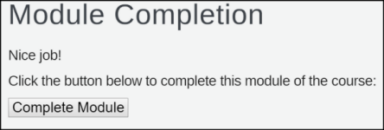
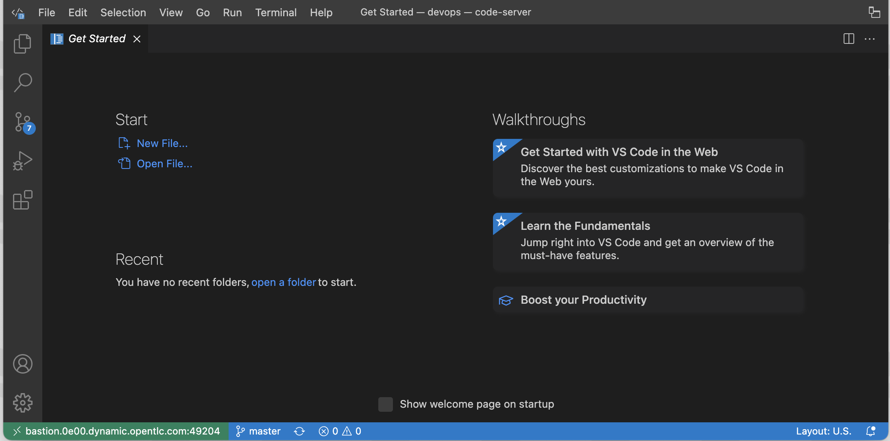
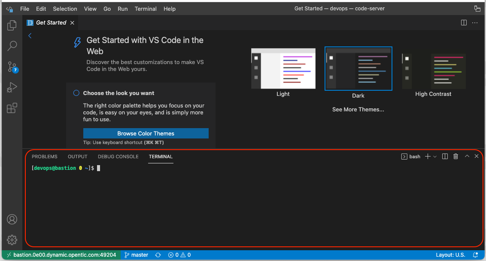

ifdef::revealjs_slideshow[]

[#cover,data-background-image="image/1156524-bg_redhat.png" data-background-color="#cc0000"]
== &nbsp;

[#cover-h1]
Red Hat^(R)^ Ansible Automation Platform 2

[#cover-h2]
Course Introduction

[#cover-logo]
image::{revealjs_cover_image}[]

endif::[]

== Course Navigation Tips

* To receive credit for completing a module, you must click the *Complete Module* button on the Module Completion slide:
+

** To confirm that you received credit for completing a module, look for a check mark next to the module name on the left side of the screen
* After exiting the course, close the course's tab in your browser
** If your course session expires before closing the course's browser tab, your progress in the course will be lost
* To display the audio transcript, press `S`
** If the transcript does not display, click the slide and press `S` again

ifdef::showscript[]

Transcript:

Here are a few tips to help you navigate through this course:

To receive credit for completing a module, you must click the *Module Complete* button on the Module Completion slide. Once you receive credit for completing a module, the x next to the module name on the left side of the screen changes to a check mark.

After exiting the course, you must close the course's tab in your browser. If your course session expires before you close the course's browser tab, then your progress in the course will be lost.

To display the audio transcript, press the "S" key.
endif::showscript[]

== Module Topics
* Course Goals
* Course Overview
* Course Activities
* Class Environment
* Lab Manager
* Visual Studio Code
* Assumptions

ifdef::showscript[]
Transcript:

This module provides an overview of the Ansible Advanced course. It explains the course goals, lists the activities you will be able to perform after finishing the course, and describes the modules that make up the course.
endif::showscript[]

== Course Goals
* Understand Ansible Automation Platform - 2
* Understand Automation developer resources
* Understand Automation Controller, Hub, and Mesh
* Understand Automation good practices
* Understand ansible roles and collections
* Use molecule to test ansible role, collections, and playbook
* Automate cloud resources deployment and configuration
* Installation and Architecture design of Automation Controller
* Installation and usage of Automation Hub
* Introduction to Automation Mesh

== Course Overview
.Course Modules
. Course Introduction
. Architecture
. Developer Resources
. Good Practices
. Building Inventory
. Building Playbook
. Testing Roles Collections and Playbooks
. IaC Automation
. Automation Controller Introduction
. Automation Controller Installation
. Automation Hub
. Automation Mesh

. Final Lab

== Course Activities
.Activities
* Lab 
* Lab Solutions
* Self Paced Lab
* Final Lab

== Class Environment

.Ansible Advanced - Lab
* *Admin Workstation* x 1
    .. *Public name*- _bastion.$GUID.dynamic.opentlc.com_
    .. *Internal name*- _bastion.example.com_
* *Content Server* x 1
    .. *Public name*- _satellite.$GUID.dynamic.opentlc.com_
    .. *Internal name*- _satellite.example.com_

ifdef::showscript[]
Transcript:

This class uses a shared Openstack environment. After you provision the environment, you will receive connection details via email.

Instructions for provisioning the environment(s) required for this course is covered in the lab(s) for this module.
endif::showscript[]

== Lab Manager
* What is *Lab Manager* (lab)?
* *Examples-*
    . lab deploy -c ad-developer
    . lab refresh -i satellite
    . lab reconfigure -p haproxy

== Lab Manager (Cont..)
* Lab Manage Command Options
+
[%autowidth,cols="^.^,^.^a,^.^a,^.^a,^.^a",options="header"]
|===
| SR No | Command  | Option-1 | Option-2 | Arguments
| {counter:lab:1} .14+| *lab*   | prep       .2+| -c     .2+| <course name>
| {counter:lab}                 | cleanup     
| {counter:lab}              .2+| deploy        | -i        | <instance_name>
| {counter:lab}                                 | -p        | <pod_name> 
| {counter:lab}              .2+| destroy       | -i        | <instance_name>
| {counter:lab}                                 | -p        | <pod_name> 
| {counter:lab}              .2+| reset         | -i        | <instance_name>
| {counter:lab}                                 | -p        | <pod_name> 
| {counter:lab}              .2+| reconfigure   | -i        | <instance_name>
| {counter:lab}                                 | -p        | <pod_name> 
| {counter:lab}                 | refresh       | -i        | satellite
| {counter:lab}                 | -h            2.+| to display all of the options
|===

== Visual Studio Code IDE
* What is Visual Studio Code IDE?
* Features:
    . Embedded Git
    . Browser accessible
    . Browser-based terminal

ifdef::showscript[]

Visual Studio Code is a source-code editor made by Microsoft for Windows, Linux, and macOS. Features include support for debugging, syntax highlighting, intelligent code completion, snippets, code refactoring, and embedded Git, browser-accessible.
endif::showscript[]

== Visual Studio Code IDE (Cont..)
* Welcome Page
+

== Visual Studio Code IDE (Cont..)
* Terminal
+

== Instructor Demo

. Demo: *Lab Manager*
. Demo: *Visual Studio Code*

== Assumptions
* You want to learn how to use Red Hat Ansible Automation Platform.
* You should have Red Hat developer account.
* You can read and modify some form of code.
* You have a workstation available for this training.
* You have an SSH client installed on your workstation.
* You are eager to experiment and find solutions.

== Summary
* Course Goals
* Course Overview
* Course Activities
* Class Environment
* Lab Manager
* Visual Studio Code
* Assumptions
