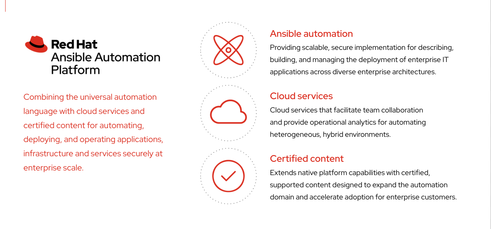
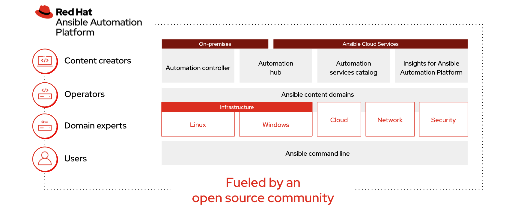
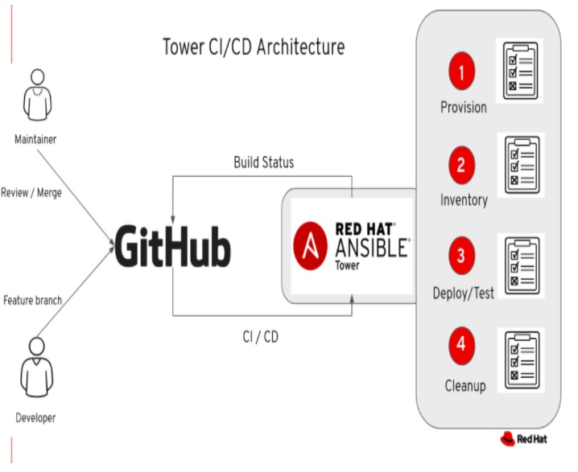

ifdef::revealjs_slideshow[]

[#cover,data-background-image="image/1156524-bg_redhat.png" data-background-color="#cc0000"]
== &nbsp;

[#cover-h1]
Red Hat^(R)^ Ansible Automation Platform 2

[#cover-h2]
Architecture

[#cover-logo]
image::{revealjs_cover_image}[]

endif::[]

== Module Topics
:linkattrs:
* Red Hat Ansible Automation Platform
** What is Red Hat Ansible Automation Platform?
** Components
* Source Control Manager
* Service Accounts
* Summary

== Red Hat Ansible Automation Platform
* *What is Red Hat Ansible Automation Platform?*
+
====

====

ifdef::showscript[]

* Ansible Automation Platform provides an enterprise framework for building and operating IT automation at scale. Users can centralize and control their infrastructure with a visual dashboard, role-based access control, and automation tools including analytics and certified, reusable content. 
 Ansible Automation Platform’s human-readable YAML automation language makes it possible for users across an organization to share, vet, and manage automation content. Collaborate across teams and get up and running quickly with searchable collections of pre-composed roles and modules so anyone can create automation.

* Red Hat® Ansible® Automation Platform is the foundation for building and operating automation services at scale, providing enterprises with a composable, collaborative, and trusted execution environment.

* Improves content management and security, robust automation deployments analytics over time, and components that can shorten time to value for automation.

* The platform is based on Ansible, an agentless IT automation technology that helps teams manage complex, multi-tier deployments and automate repetitive tasks. 

* Ansible Automation Platform is fully certified for integration with Red Hat Enterprise Linux, Red Hat OpenShift®, and more. An easy installer is available for on-premise or cloud deployment. 

endif::showscript[]

== RedHat Ansible Automation Platform
* Components
+
====

====

== Source Control Manager
* SCM
+
====

====

== Service Accounts
* Understanding Service Account
** Create Service Account
** Secure Authentication
** Service User Privileges

ifdef::showscript[]

* Service user account is the user on Linux/unix platform which we use to connect node from remote location

* SSH public key authentication improves security considerably as it frees the users from remembering complicated passwords. The ssh public key encryption uses Asymmetric Cryptography algorithms, works with two separate keys. These two keys form a pair that is specific to each user.
** Each SSH key pair includes two keys:
. Public Key: This key gets copied to SSH server,
. Private Key: This key remains with the user.

* In Red Hat Enterprise Linux, there is program called Sudo, which is use to allow a user to use root privileges for a limited timeframe to users and log root activity. The term “Sudo” means substitute user, and do. Sudo used for managing of user permission based on a system configuration file. It allows users to run programs with the privileges of another user, by default, the superuser (root).

endif::showscript[]

== Summary
* Red Hat Ansible Automation Platform
** What is Red Hat Ansible Automation Platform?
** Components
* Source Control Manager
* Service Accounts
* Summary