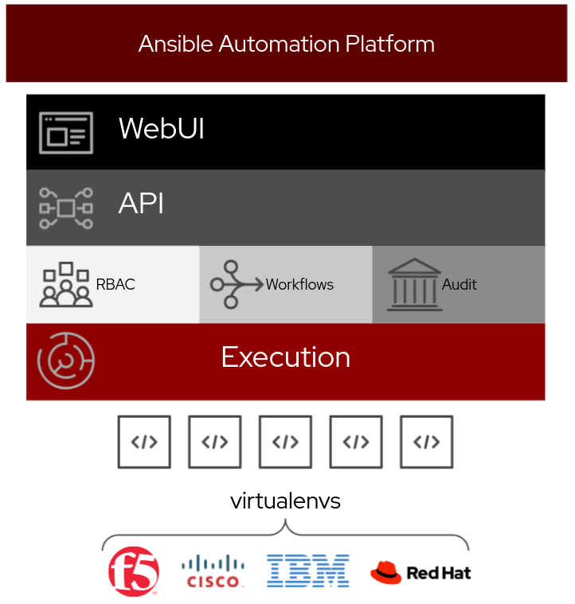
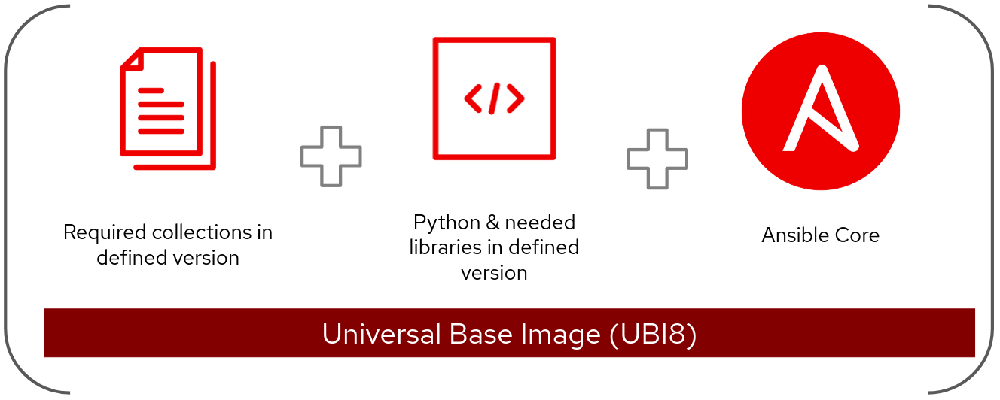

ifdef::revealjs_slideshow[]

[#cover,data-background-image="image/1156524-bg_redhat.png" data-background-color="#cc0000"]
== &nbsp;

[#cover-h1]
Red Hat^(R)^ Ansible Automation Platform 2

[#cover-h2]
Introduction

[#cover-logo]
image::{revealjs_cover_image}[]

endif::[]

== Module Topics
:linkattrs:

* Ansible Tower vs Automation Controller
** Ansible Tower
** Automation Controller
* Automation controller overview
** Architecture
** WEBUI
** Postgresql 12
* Automation Controller Services
* Automation Mesh
** Introduction
* Automation Mesh Architecture
* Automation Mesh Design Patterns
* RedHat Automation Platform
** Support
** Subscription
** Usage
** Components
* Ansible Automation Platform Component Licenses
* Reference Architecture
* Summary

== Ansible Tower vs Automation Controller

* Ansible Tower
+
====

====

ifdef::showscript[]

* Rigid and tightly coupled
. The Ansible Tower architecture tightly coupled the control and execution plane, which can increase overhead and inefficiencies when scaling to meet high demand.
. For example, let’s imagine the networking team creates new automation content that relies on the netaddr 0.7.20 Python package. The security team, however, has developed their automation using a later version of netaddr. Both teams need a unique netaddr version to execute their automation successfully.

. Automation operators spend significant time confirming that the different versions of netaddr are available and consistent across Ansible Automation Platform instances or jointly manage these dependencies with these teams.

. Imagine the overhead required to make sure consistent execution multiplies as more teams join, deployed instances increase, and automation content expands.

* Inconsistent execution 
. Automation teams need to verify that automation content executes consistently across the enterprise.

. Ansible Tower used Python virtual environments to manage dependencies, but this method introduced challenges.

. Managing Python virtual environments across multiple Ansible Tower instances slowed development cycles, as additional effort was needed to prevent inconsistent non-production and production systems.

. Confirming custom dependencies were consistent across Ansible Tower instances grew in complexity as you increased deployments and as more users interacted with it.

. Python virtual environments were challenging to port across Ansible Tower instances and tightly coupled to the control plane.

. There are no tools supported and maintained by Red Hat to manage custom dependencies across Ansible Automation Platform deployments.

endif::showscript[]

== Ansible Tower vs Automation Controller

* Automation Controller
+
====

====

ifdef::showscript[]

* Automation teams need to provide automation rapidly where and when the business needs it. They need to help their organizations automate for growth. 

* Automation controller introduces a distributed, modular architecture with a decoupled control and execution plane. It enables teams to scale and deliver automation with reduced overhead and increased velocity.

* Automation execution environments
** Portability is reliability

. Ansible Automation Platform 2 introduces automation execution environments. These are self-contained images in which all automation runs, including Ansible Core, Ansible content, and any additional dependencies.

. Using automation execution environments, automation can run consistently across multiple platforms. All custom dependencies are defined at the development phase and are no longer tightly coupled to the control plane, resulting in faster development cycles, scalability, reliability and portability across environments.

* PostgreSQL 12

. Ansible Automation Platform 2 ships with PostgreSQL 12 installed from Red Hat Enterprise Linux 8 modules by default.

endif::showscript[]

== Automation Controller Overview

* Architecture
+
====

====

ifdef::showscript[]

* ARCHITECTURE
. Decentralized, modular application
. Decoupled control and execution plane
. Execution environments

* Automation controller uses Python 3.8

* Nginx has been updated to version 1.18 and uses RHEL 8 cryptography profiles.

* Automation operators can disable the ability to add local users to automation controller 4.0 and only allow authentication via a configured identity provider.

* Automation controller 4.0 provides new Prometheus metrics for tracking and debugging job event performance.

endif::showscript[]

== Automation Controller Overview

* WebUI
+
====

====

ifdef::showscript[]

* WEBUI
. Refactored to PatternFly 4.0
. Increased performance
. Job output filters
. Distinct “edit” and “read” views
. Stricter Content Security Policy

* PatternFly 4

. The interface uses the PatternFly 4 framework. This change enables increased performance and consistency with other Ansible Automation Platform 2 components and Red Hat offerings.

* Improved observability, interaction, and security

. The improved interface introduces distinct view and edit perspectives for automation controller objects and components — a frequently requested capability in our customers’ feedback.

* Content Security Policy

The automation controller’s interface redesign includes a strict Content Security Policy adding an additional layer of protection that detects and mitigates common cybersecurity threats.

endif::showscript[]

== Automation Controller Overview

* PostgreSQL 12 
+
====

====

ifdef::showscript[]

* POSTGRESQL 12
. Installed from RHEL modules
. Partitioned access - increased performance

* Ansible Automation Platform 2 ships with PostgreSQL 12 installed from Red Hat Enterprise Linux 8 modules by default.

* PostgreSQL 12 introduces a host of significant improvements. Most notably, Ansible Automation Platform 2 uses partitioned access for enhanced performance.

endif::showscript[]

== Automation Controller Services

* Instance Services
+
====
image::./images/06_tower-clustering-visual.png[AAP,width=60%,align="center"]
====

ifdef::showscript[]

Transcript:

* Instance Services

HTTP Services - This includes the Tower application itself as well as external web services.

Callback Receiver - Receives job events from running Ansible jobs.

Dispatcher - The worker queue that processes and runs all jobs.

Redis - This key value store is used as a queue for event data propagated from ansible-playbook to the application.

Rsyslog - log processing service used to deliver logs to various external logging services.

endif::showscript[]

== Automtion Mesh

* Introduction

====

====

ifdef::showscript[]

* Automation mesh aims to simplify this undertaking and, in conjunction with automation controller, provides a scalable, reliable solution that reduces the operational overhead associated with multi-site deployments. 

* Ansible Tower and isolated nodes made scaling across multiple regions and complex networks challenging to manage. Ansible Tower’s tightly coupled shared execution and control capacity made scaling automation challenging to implement and manage.

* While pushing changes to one site was straightforward using the previous architecture, how do you reliably and consistently deploy changes to dozens of locations across the globe? The answer to this is automation mesh. 

* Automation mesh removes the dependency on ancillary tools such as jump hosts and SSH proxies by localizing automation.

* The distributed design reduces the overall platform footprint and operational overhead associated with managing multiple, isolated platform clusters.01
endif::showscript[]

== Automation Mesh Architecture

* Architecture
+
====

====

ifdef::showscript[]

* The control plane consists of hybrid and control nodes. Instances in the control plane run persistent automation controller services such as the the web server and task dispatcher, in addition to project updates, and management jobs.

* The execution plane consists of execution nodes that execute automation on behalf of the control plane and have no control functions. 

* How do the bits related to each other, and how does the communication flow works?

In this image we see the overall architecture of the different components and how they work with each other, from a consumer perspective. The consumer on the left side accesses the interface of their choice - web UI or API - and triggers pre-created automation content via a self-service portal. This process is governed by enterprise RBAC support, and approval processes make sure that no one requests more automation than they should be granted.

In the end, the execution of the content will be triggered, and that will automate the pieces the user needs to be.

endif::showscript[]

== Automation Mesh Architecture

* Control plane

** Hybrid Nodes

** Control Nodes

ifdef::showscript[]

* Hybrid nodes - this is the default node type for control plane nodes, responsible for automation controller runtime functions like project updates, management jobs and ansible-runner task operations. Hybrid nodes are also used for automation execution.

* Control nodes - control nodes run project and inventory updates and system jobs, but not regular jobs. Execution capabilities are disabled on these nodes.

endif::showscript[]

== Automation Mesh Architecture

* Execution plane

** Execution nodes

** Hop nodes

ifdef::showscript[]

* Execution nodes - Execution nodes run jobs under ansible-runner with podman isolation. This node type is similar to isolated nodes.

* Hop nodes - similar to a jump host, hop nodes will route traffic to other execution nodes. Hop nodes cannot execute automation.

endif::showscript[]

== Automation Mesh Design Patterns

* Standard control plane (3 node) and (n) execution nodes, fully connected
** Sample Installation Inventory: 
+
[source,sh]
----
[automationcontroller]
control-plane-1.example.com
control-plane-2.example.com
control-plane-3.example.com

[automationcontroller:vars]
node_type=control
peers=execution_nodes

[execution_nodes]
execution-node-1.example.com peers=execution-node-2.example.com
execution-node-2.example.com peers=execution-node-3.example.com
execution-node-3.example.com peers=execution-node-4.example.com
execution-node-4.example.com peers=execution-node-5.example.com
execution-node-5.example.com peers=execution-node-6.example.com
execution-node-6.example.com peers=execution-node-7.example.com
execution-node-7.example.com

[execution_nodes:vars]
node_type=execution
----

ifdef::showscript[]

Peer connections

Create node-to-node connections using the peers= host variable. In the example, we connect control-plane-1.example.com to execution-node-1.example.com, and execution-node-1.example.com to `execution-node-2.example.com`

endif::showscript[]

== Red Hat Ansible Automation Platform
.Support
* *Standard*
 . Manage any size environment
 . Enterprise 8x5 support and SLA
 . Maintenance and upgrades included

* *Premium*
 . Manage any size environment, including mission-critical environments
 . Premium 24x7 support and SLA
 . Maintenance and upgrades included

ifdef::showscript[]

* Red Hat offers support to paid Red Hat Ansible Automation Platform customers.
* Red Hat Ansible Automation Platform is provided at various levels of support and number of machines as an annual Subscription.
* Review the SLA at: https://access.redhat.com/support/offerings/production/sla
* Review the Red Hat Support Severity Level Definitions at: https://access.redhat.com/support/policy/severity

endif::showscript[]

== Red Hat Ansible Automation Platform
.Subscription
* Sold and supported by counting the number of *managed nodes*.
* Managed Nodes are any "Node" managed by the Red Hat Ansible Automation Platform.

ifdef::showscript[]

* Managed Node: "Node" refers to a Virtual Node, Physical Node or other identifiable* instance of Software and/or Configuration being directly or indirectly managed by Red Hat Ansible Automation Platform.

. Examples of managed nodes that should be accounted for include but are not limited to:

  Servers, Virtual Machines and other physical devices e.g. Storage Arrays
  Containers, appliances, software instances (database, middleware, applications) and other virtual devices
  SDN, Wireless and other Networking Controllers

* Managed Node Use Cases:
** For clustered technology platforms being directly managed, or managed indirectly via an API, each instance of technology within a managed cluster counts as a managed node. Example: Oracle Database
** For physical or virtual instances being directly managed by Ansible, where Ansible identifies and connects to the instance, each instance counts as a single managed node.
** For infrastructure or application software instances being directly managed or managed via an API, each instance counts as a managed node. Example: Red Hat Openstack

endif::showscript[]

== Ansible Automation Platform Component Licenses

* Component License

** */usr/share/doc/automation-controller-<version>/README*

ifdef::showscript[]

To view the license information for the components included within automation controller, refer to /usr/share/doc/automation-controller-<version>/README where <version> refers to the version of automation controller you have installed.

To view a specific license, refer to /usr/share/doc/automation-controller-<version>/*.txt, where * is replaced by the license file name to which you are referring.

endif::showscript[]

== Reference Architecture

====
image::images/04_reference_architecture.png[AAP,width=80%,align="center"]
====

ifdef::showscript[]
* The image consists of two sites, Ansible Site 1 and Ansible Site 2 for high availability. Site one is an active environment while site two is a passive environment. Each site consists of:

** three node automation controller cluster with one PostgreSQL database

** three node automation hub cluster with one PostgreSQL database

** Two execution nodes per automation controller cluster
** Access to console.redhat.com services such as Red Hat Insights and Service Catalog

* In order to achieve HA for the PostgreSQL databases, configuration as code in conjunction with Git webhooks are used when push or merge events are triggered on a Git repository which in turn will configure the specified event on both Ansible Site 1 and Ansible Site 2.

* Finally, to ensure logging consistency, a highly available centralized logging environment is installed that both Ansible Automation Platform environments will use.

endif::showscript[]

== Summary

* Ansible Tower vs Automation Controller
** Ansible Tower
** Automation Controller
* Automation controller overview
** Architecture
** WEBUI
** Postgresql 12
* Automation Controller Services
* Automation Mesh
** Introduction
* Automation Mesh Architecture
* Automation Mesh Design Patterns
* RedHat Automation Platform
** Support
** Subscription
** Usage
** Components
* Ansible Automation Platform Component Licenses
* Reference Architecture
* Summary