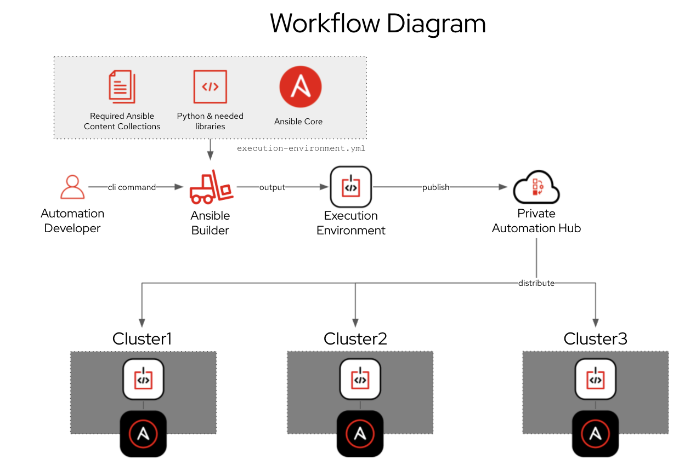
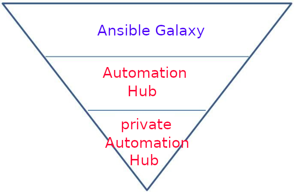

ifdef::revealjs_slideshow[]

[#cover,data-background-image="image/1156524-bg_redhat.png" data-background-color="#cc0000"]
== &nbsp;

[#cover-h1]
Red Hat^(R)^ Ansible Automation Platform 2

[#cover-h2]
Automation Hub

[#cover-logo]
image::{revealjs_cover_image}[]

endif::[]

== Module Topics
:linkattrs:

* Hosted Automation Hub
* Private Automation Hub
* Who uses private automation hub?
* Workflow
* System Requirements
* Installation
* Installation Scenarios
* Standalone automation hub with a database on the same node
* Standalone automation hub with an external managed database
* Platform installation with a database on the automation controller node
* Installation Script
* Automation Hub Representation
* Ansible Content Sync
* Publish Private Collections
* Manage Custom Execution Enviorments
* Synchronize private automation hub with automation controller
* Summary

== Hosted Automation Hub

* Official location to discover and download supported collections.
* Direct access to trusted content collections from Red Hat and Certified Partners.
* Downstream Red Hat supported product version of Ansible Galaxy
* Part of the Red Hat Ansible Automation Platform subscription

== Private Automation Hub 
* On-premises version of Automation Hub.
* Privately hosted location for all Ansible content.
* Allows automation teams to curate Ansible available from different sources.
* Serve as the on-premises execution environment container image repository.

ifdef::showscript[]

* Private automation hub will serve as the on-premises execution environment container image repository for customers who wish to use this feature, aimed at customers who run the platform on physical or virtual environments.

* Ansible Automation Platform will seamlessly integrate with private automation hub for publishing and pulling execution environment container images.

* Private automation hub in Ansible Automation Platform 2 primarily delivers support for automation execution environments. 

endif::showscript[]

== Who uses private automation hub?

* Automation creators

* Automation architects

* Automation operators

ifdef::showscript[]

* Private automation hub is intended for curating automation content from creators and making it seamlessly accessible to operators.

* It makes it easy to share these execution environments, which make it simple to package everything into turnkey automation, to other developers or operators for production use cases across your organization.

*  Automation controller can sync directly to private automation hub, pull curated execution environments to use and provide governance around what is available.

* Automation creators develop Ansible Playbooks, roles and modules.

* Automation architects elevate automation across teams to align with IT processes and streamline adoption.

* Automation operators ensure the automation platform and framework are operational.

endif::showscript[]

== Workflow
* Automation Hub Workflow
+
====

====

ifdef::showscript[]

* In the high level diagram you can see that automation developers will create content like they did before this release. 

* The command line utility execution environment builder ansible-builder creates an execution environment based on your execution-enviornment.yml

* Automation creators can publish content to private automation hub.

* Same EE will be available to all the clusters using Private Automation Hub. 

endif::showscript[]

== System Requirements 
* Requirements
+
[%autowidth,cols="^.^,^.^a,^.^a",options="header"]
|===
| Automation Hub Nodes | Required | Notes
| OS | RHEL 8.4 or later 64-bit | -
| Ansible | version 2.11 required | If Ansible is not already present on the system, 
                                     the setup playbook will install ansible-core 2.12.
| RAM  | 8 Gb |  -
| CPUs | 2 | For capacity based on forks in your configuration.
| Disk: service node | 40Gb dedicated hard disk space | Storage volume should be rated for a  minimum baseline of 1500 IOPS.
| Disk: database node | 20Gb dedicated hard disk space | 150 GB+ recommended
|===

ifdef::showscript[]

* Service Node: Private Automation Hub

* Database Node: Postgresql 12 external database node.

endif::showscript[]

== Installation

* Installer

** Installing with internet access
*** Red Hat Ansible Automation Platform installer

** Installing without internet access
*** Red Hat Ansible Automation Platform *Bundle* installer

ifdef::showscript[]

* Choose the Red Hat Ansible Automation Platform installer if your Red Hat Enterprise Linux environment is connected to the internet. Installing with internet access will retrieve the latest required repositories, packages, and dependencies.

* Use the Red Hat Ansible Automation Platform Bundle installer if you are unable to access the internet, or would prefer not to install separate components and dependencies from online repositories. Access to Red Hat Enterprise Linux repositories is still needed. All other dependencies are included in the tar archive.

endif::showscript[]

== Installation Scenarios
* Standalone automation hub 
   ** With a database on the same node
   ** Or a non-installer managed database
* Standalone automation hub with an external managed database
* Platform installation 
   ** With a database on the automation controller node
   ** Or non-installer managed database

ifdef::showscript[]

* Standalone automation hub with a database on the same node, or a non-installer managed database
** This scenario includes installation of automation hub, including the web frontend, REST API backend, and database on a single machine. It installs PostgreSQL, and configures the automation hub to use that as its database.

* Standalone automation hub with an external managed database
** This scenario includes installation of the automation hub server on a single machine, and installs a remote PostgreSQL database, managed by the Red Hat Ansible Automation Platform installer.

* Platform installation with a database on the automation controller node, or non-installer managed database
** This scenario includes installation of automation controller and automation hub with a database on the automation controller node, or a non-installer managed database.

endif::showscript[]

== Standalone automation hub with a database on the same node
* Ex: Inventory File
+
[source,ini]
----
[automationcontroller]

[automationhub]                           <1>
127.0.0.1 ansible_connection=local

[all:vars]                                <2>
registry_url='registry.redhat.io'
registry_username='<registry username>'
registry_password='<registry password>'

automationhub_admin_password= <PASSWORD>

automationhub_pg_host=''
automationhub_pg_port=''

automationhub_pg_database='automationhub'
automationhub_pg_username='automationhub'
automationhub_pg_password=<PASSWORD>
automationhub_pg_sslmode='prefer'
----

ifdef::showscript[]

1. `automationhub` group for lisitng nodes to install standalone automation hub node.
2. `all:vars` all the variables realted to automation controller, database can be set under this section.

endif::showscript[]

== Standalone automation hub with an external managed database
* Ex: Inventory File
+
[source,ini]
----
[automationcontroller]

[automationhub]                     <1>
127.0.0.1 ansible_connection=local

[database]                          <2>
acdb.example.com

[all:vars]
registry_url='registry.redhat.io'
registry_username='<registry username>'
registry_password='<registry password>'

automationhub_admin_password= <PASSWORD>

automationhub_pg_host=''
automationhub_pg_port=''

automationhub_pg_database='automationhub'
automationhub_pg_username='automationhub'
automationhub_pg_password=<PASSWORD>
automationhub_pg_sslmode='prefer'

----

ifdef::showscript[]

1. `automationhub` group for lisitng nodes to install standalone automation hub node.
2. `database` group for listing external managed database.
2. `all:vars` all the variables realted to automation hub, database can be set under this section.

endif::showscript[]

== Platform installation with a database on the automation controller node
* Ex: Inventory File
+
[source,ini]
----
[automationcontroller]
ac1.example.com
ac2.example.com
ac3.example.com

[automationhub]
ah.example.com

[database]
acdb.example.com

[all:vars]
admin_password='<password>'
pg_host='acdb.example.com'
pg_port='5432'
pg_database='awx'
pg_username='awx'
pg_password='<password>'
pg_sslmode='prefer'  # set to 'verify-full' for client-side enforced SSL

registry_url='registry.redhat.io'
registry_username='<registry username>'
registry_password='<registry password>'

# Automation Hub Configuration
#
automationhub_admin_password='<password>'
automationhub_pg_host='acdb.example.com'
automationhub_pg_port='5432'
automationhub_pg_database='automationhub'
automationhub_pg_username='automationhub'
automationhub_pg_password='<password>'
automationhub_pg_sslmode='prefer'
----

ifdef::showscript[]
1. `automationcontrolle`: group listing nodes to install ACs
2. `automationhub` group for lisitng nodes to install automation hub node.
3. `database` group for listing external managed database.
4. `all:vars` all the variables realted to automation hub, database can be set under this section.

endif::showscript[]

== Installation Script
* *setup.sh*
   ** `-h` – HELP
   ** `-i` <INVENTORY_FILE_NAME> 
   ** `-e` EXTRA_VARS 
+
.Example
[source,sh]
----
$ ./setup.sh -i inventory
----

ifdef::showscript[]

Transcript:
* The setup playbook script uses the inventory file and is invoked as ./setup.sh from the path where you unpacked the Tower installer tarball.

* The setup script takes the following arguments:
   ** `-h` – Show this help message and exit
   ** `-i` <INVENTORY_FILE_NAME> – Path to Ansible inventory file (default: inventory)
   ** `-e` EXTRA_VARS – Set additional Ansible variables as key=value or YAML/JSON (i.e. -e bundle_install=false forces an online installation)

endif::showscript[]

== Automation Hub Representation

* Representation
+
====

====

ifdef::showscript[]

* Automation Hub holds Collections. 
* Ansible Galaxy is the largest community repository that hosts a ton of Collections. 
* Everyone can publish their standalone roles and Collections on Ansible Galaxy.
* Automation Hub on cloud.redhat.com contains certified Ansible Content Collections and supported ones by Red Hat and a vast ecosystem of partners, available through a valid Red Hat Ansible Automation Platform subscription.
* As for the private Automation Hub, its purpose is to host your personal Collections and curated content from Automation Hub or Ansible Galaxy.
* Red Hat supports both Automation Hub and private Automation Hub represented by the color red in the inverted pyramid diagram above. In contrast, Ansible Galaxy can be seen as the upstream version of Automation Hub and private Automation Hub, represented with the color blue.

endif::showscript[]

== Ansible Content Sync
****
[.text-center]
Instructor Demo: *Ansible Content Sync*
****

ifdef::showscript[]

https://www.ansible.com/blog/fun-with-private-automation-hub-part-1

This can be a good demo. 

endif::showscript[]

== Private Collection Publish 

****
[.text-center]
Instructor Demo: *Publish Collection Publish*
****

ifdef::showscript[]

https://www.ansible.com/blog/fun-with-private-automation-hub-part-1

This can be a good demo. 

endif::showscript[]

== Manage Custom Execution Enviorments 

****
[.text-center]
Instructor Demo: *Manage Custom EE*
****

ifdef::showscript[]

https://www.ansible.com/blog/whats-new-in-ansible-automation-platform-2-private-automation-hub

This can be a good demo. 

endif::showscript[]

== Synchronize private automation hub with Automation controller

****
[.text-center]
Instructor Demo: *Sync Private Automation Hub with Automation controller*
****

ifdef::showscript[]

https://www.ansible.com/blog/whats-new-in-ansible-automation-platform-2-private-automation-hub

This can be a good demo. 

endif::showscript[]

== Summary

* Hosted Automation Hub
* Private Automation Hub
* Who uses private automation hub?
* Workflow
* System Requirements
* Installation
* Installation Scenarios
* Standalone automation hub with a database on the same node
* Standalone automation hub with an external managed database
* Platform installation with a database on the automation controller node
* Installation Script
* Automation Hub Representation
* Ansible Content Sync
* Publish Private Collections
* Manage Custom Execution Enviorments
* Synchronize private automation hub with automation controller
* Summary
